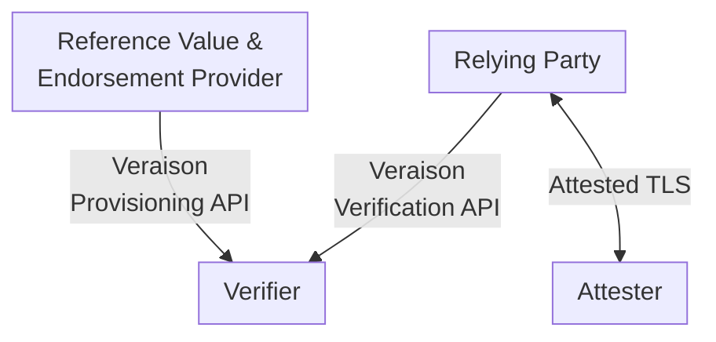

# Demo

This demo showcases a TLS-protected exchange that uses attestation Evidence instead of X.509 credentials to identify and authenticate a client to a server.

In [RATS terms](https://www.rfc-editor.org/rfc/rfc9334.html#figure-1), the TLS client is the Attester, while the TLS server is the Relying Party.

The Relying Party delegates checking the trustworthiness of the Evidence presented by the Attester to an attestation Verifier, using a [background check](https://www.rfc-editor.org/rfc/rfc9334.html#figure-6) arrangement.

A successful handshake is predicated on the provisioning of the Reference Values and Endorsements associated with the Attester to the Verifier.



## Actions

> **Note**: All the `make(1)` targets below must be invoked in the current directory.

1. Start up the demo environment:

> **Warning**: The first time it is run, this will build several Docker container images.  On a M1 laptop the process has been observed to take up to 20 minutes.

```shell
make start
```

2. Obtain verification keys and PCR golden values from the TPM, repackage into [CoRIM](https://datatracker.ietf.org/doc/draft-ietf-rats-corim), and send to the Verifier:

```shell
make endorse
```

3. Run an [Attested TLS](https://datatracker.ietf.org/doc/draft-fossati-tls-attestation) handshake between client and server:

```shell
make handshake
```

4. Tear down the demo environment:

```shell
make stop
```
