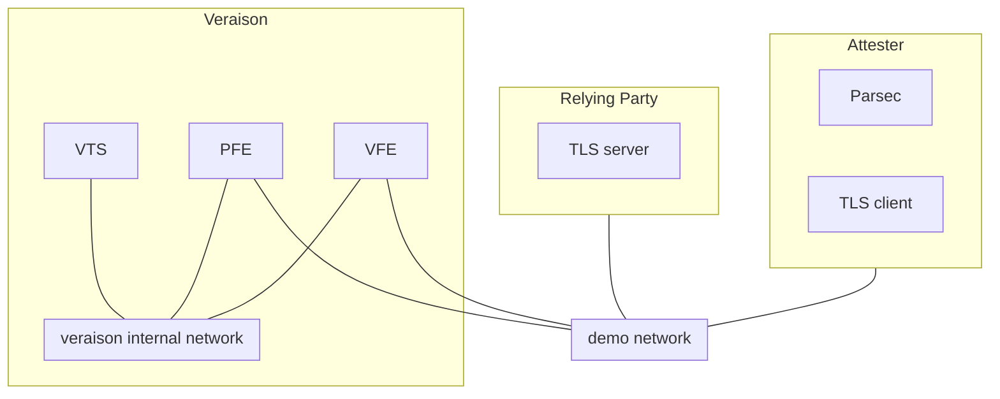

```mermaid
flowchart TD
    subgraph VrsnNet [veraison internal network]
    end

    subgraph DemoNet [demo network]
    end

    subgraph Vrsn [Veraison]
    direction TB
    VrsnNet
    VFE
    VTS
    PFE
    end

    subgraph Attester [Attester]
    Parsec
    Client["TLS client"]
    end

    subgraph rp [Relying Party]
    Server["TLS server"]
    end


    Attester --- DemoNet
    rp --- DemoNet
    VFE --- DemoNet
    PFE --- DemoNet
    VFE --- VrsnNet
    PFE --- VrsnNet
    VTS --- VrsnNet
```
